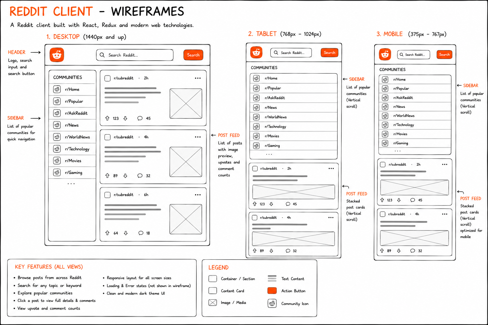

## Wireframes

## Technologies Used

- React
- Redux Toolkit
- React Router
- Vite
- Jest & React Testing Library
- CSS
- RapidAPI (Reddit API)

## Features

- Browse popular posts and subreddits
- Search for posts
- View post details and comments
- Responsive design
- Loading and error states
- Redux state management
- Tested with Jest and React Testing Library

## Future Work

- User authentication
- Voting, saving, and sharing posts
- Infinite scrolling
- Advanced search and filtering